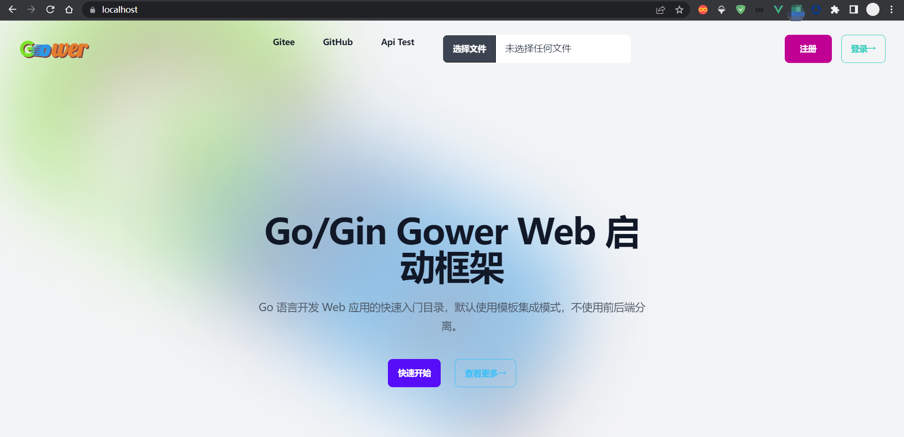
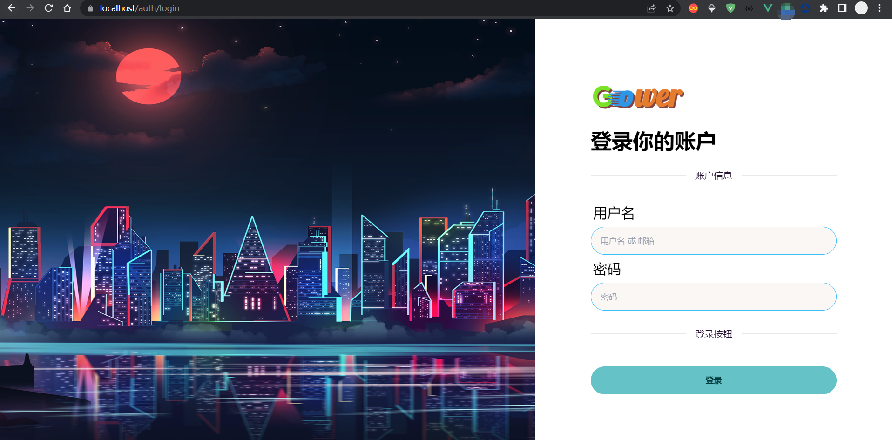
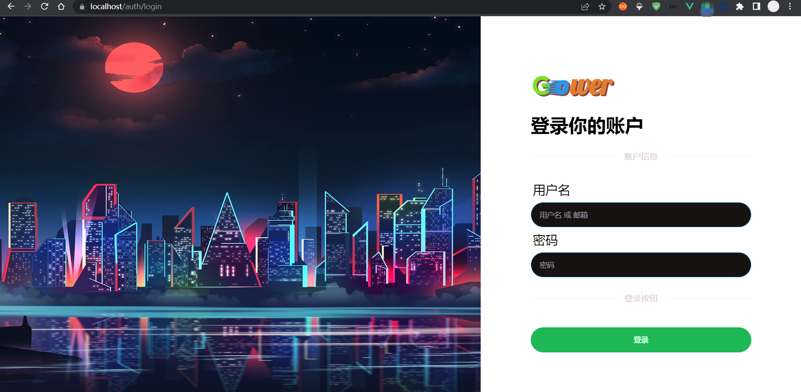
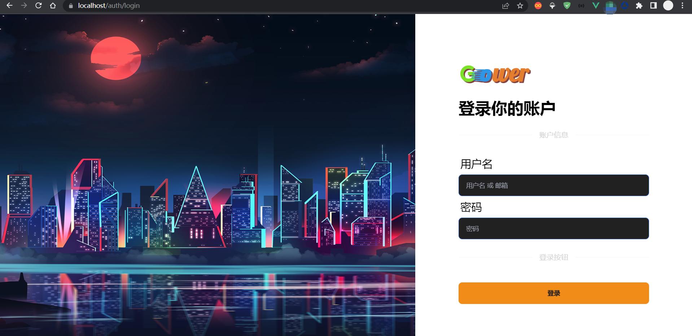
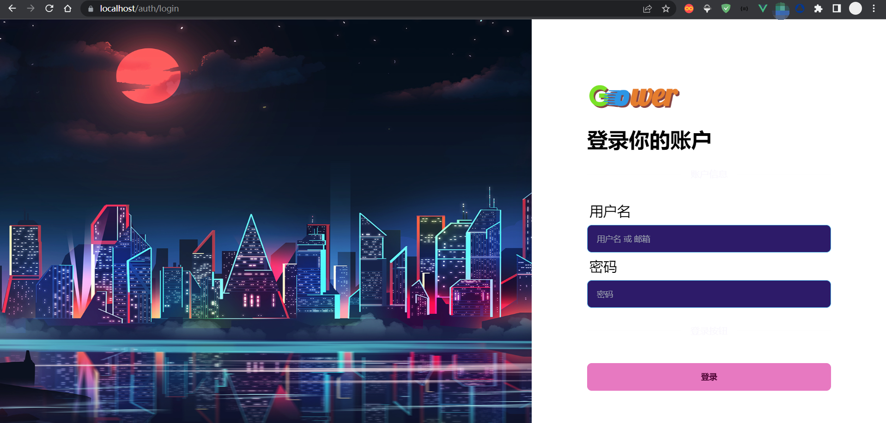

[TOC]

# Go/Gin Gower Workspace 工作目录

`workspace`

[中文](README.md)|[English](README_EN.md)

[](LICENSE) [](tests/benchmarks/benchmark) [](https://github.com/falling-ts/gower/actions) []()

---

Go/Gin Gower Workspace 基于 Go 语言 Workspace 与 GOPATH 相结合实现工作空间模式。使用 Gradle 对多个 Gower 程序进行开发与打包管理，实现类似微服务架构的一种模式。

系统要求:

> go >= v1.23
>
> nodejs >= v16.13
>
> pnpm >= v7.0
>
> docker >= v20.10 [非必要]
>
> docker compose >= v2.0 [非必要]
>
> git >= 2.39
>
> gradle == 8.10.2
>
> jvm >= 23

## 快速开始[工作空间模式]

### 下载源码

```shell
$ git clone -b v0.6.0 --single-branch --depth 1 https://github.com/falling-ts/gower-work.git
```

### 使用 Goland 打开下载 `gower-work`

- 提前在 Goland 中安装好 gradle 插件
- 第一次使用 Goland 打开 `gower-work` 时，会提醒 `找到Gradle 'gower-work' 构建脚本`，然后点击 `加载 Gradle 项目`，会初始化 gradle 构建体系
- 找到 `设置/GO/GOPATH/项目GOPATH`，添加 `gower-work` 所在的绝对目录
- 这样在项目内执行 `go install` 时，会自动把二进制安装到 bin 目录下
- 项目目录下的 bin 也会添加到内置终端的环境变量中，方便执行命令

### 安装 Gower Cli 工具

- 找到右侧 gradle 工具栏
- 找打 `gower-work/Tasks/init/InstallGowerCli`，双击运行，将安装 gower.exe 至 bin 目录下

### 新建一个 Gower 项目

- 在 `gower-work` 项目根目录终端上，执行：
```shell
$ gower create my-project
```
- 运行结果如下：
```shell
src\my-project 项目创建成功
---------------- 初始化 APP 密钥...:
APP 密钥生成成功
---------------- 初始化 JWT 密钥...:
JWT 密钥生成成功
---------------- 下载 Go 依赖包...:
---------------- 下载前端依赖包...:
Lockfile is up to date, resolution step is skipped
......
+ @types/vue 2.0.0
+ @vitejs/plugin-vue 4.0.0
+ cross-env 7.0.3
+ vite 5.4.6

Done in 1.2s
---------------- 初始化 Git 仓库...: 
Initialized empty Git repository in D:/Go/gower-work/src/my-project/.git/
---------------- 添加所有文件...: 
---------------- 初始化 commit...: 
......
create mode 100644 utils/slice/strings.go
create mode 100644 utils/str/str.go
create mode 100644 vite.config.js
---------------- 构建前端库文件...:
......
public/static/main.umd.cjs    640.00 kB │ gzip: 211.13 kB
✓ built in 4.88s
npm notice
npm notice New minor version of npm available! 10.7.0 -> 10.9.0
npm notice Changelog: https://github.com/npm/cli/releases/tag/v10.9.0
npm notice To update run: npm install -g npm@10.9.0
npm notice
---------------- 添加工作目录...:
---------------- 执行基准测试...: 
2023-10-17 12:48:37, ERROR, Gower, Error Trace, {"error": "record not found", "sql": "SELECT * FROM `admin
_users` WHERE `admin_users`.`id` = 1 AND `admin_users`.`deleted_at` IS NULL ORDER BY `admin_users`.`id` LIMIT 1", "elapsed": 0, "rows": 0}
......
Benchmark/BenchmarkEncode-12             1896417               628.9 ns/op
Benchmark/BenchmarkDecode-12             3177018               389.5 ns/op
PASS
ok      my-project      25.313s
```

### 运行项目

- 在 gradle 任务中找到 `my-project/Tasks/dev/Run`，双击运行
- 运行结果如下：
```shell
......
> Task :my-project:t0300GoBuild
# go build -tags tmpl,static -o my-project.exe

> Task :my-project:Run
# my-project.exe run
http://localhost:8080

BUILD SUCCESSFUL in 10s
6 actionable tasks: 6 executed
00:57:32: 执行完成 'Run'。
```
- 点击 `http://localhost:8080` 会打开浏览器，并访问项目

## 快速开发

### 创建控制器

```shell
$ gower make --controller Hello
```

`app/http/controllers/hello_controller.go`

```shell
package controllers

import (
    "gower/app"
    "gower/app/http/requests"
    "gower/services"
)

type HelloController struct {
    app.Controller
}

var Hello = new(HelloController)

// Index 获取页面
func (*HelloController) Index(req *requests.HelloRequest) (services.Response, error) {
    return res.Ok("home/hello", app.Data{
        "name": req.Name,
    }), nil
}

```

### 创建请求

```shell
$ gower make --request Hello
```

`app\http\requests\hello_request.go`

```shell
package requests

import "gower/app"

type HelloRequest struct {
    app.Request

    Name *string `form:"name" json:"name" binding:"required"`
}
```

### 创建模型

```shell
$ gower make --model Hello
```

`app\models\hello.go`

```shell
package models

func init() {
    migrate(new(Hello))
}

type Hello struct {
    Model

    Name *string `gorm:"type:string;default:'';comment:名称"`
}
```

> 注: 如果命令输出很多 Debug 内容，那是因为 envs/.env.dev 的 APP_MODE 是开发模式, 修改为测试模式就可以了

### 添加路由

`routes/web.go`

```shell
package routes

import (
    web "gower/app/http/controllers"
    mws "gower/app/http/middlewares"
    "gower/public"
)

func init() {
    // ...

    route.GET("/hello", web.Hello.Index)
}
```

### 执行请求

```shell
$ curl -i http://localhost:8080/hello?name=Gower
```

## 使用的第三方库和内容，同时表达对开源的感谢

```

github.com/alexedwards/argon2id v1.0.0
github.com/caarlos0/env/v7 v7.1.0
github.com/gin-contrib/cors v1.7.2
github.com/gin-gonic/gin v1.10.0
github.com/glebarez/sqlite v1.11.0
github.com/go-playground/locales v0.14.1
github.com/go-playground/universal-translator v0.18.1
github.com/go-playground/validator/v10 v10.22.1
github.com/go-sql-driver/mysql v1.8.1
github.com/golang-jwt/jwt/v5 v5.2.1
github.com/jaevor/go-nanoid v1.4.0
github.com/joho/godotenv v1.5.1
github.com/patrickmn/go-cache v2.1.0+incompatible
github.com/stretchr/testify v1.9.0
github.com/urfave/cli/v2 v2.27.5
go.uber.org/zap v1.27.0
golang.org/x/crypto v0.28.0
gorm.io/driver/mysql v1.5.7
gorm.io/gorm v1.25.12

github.com/rclone/rclone v1.62.2
github.com/laravel/laravel
github.com/moby/moby
github.com/docker/compose

FROM caddy:2.6
FROM grafana/grafana:9.4.3
FROM grafana/loki:main-0295fd4
FROM mysql/mysql-server:5.7.41
FROM grafana/promtail:main-0295fd4
FROM pingcap/tidb:v6.5.1

nodejs
pnpm
"animate.css": "^4.1.1",
"autoprefixer": "^10.4.13",
"daisyui": "^2.51.2",
"jquery": "^3.6.3",
"js-cookie": "^3.0.1",
"jssha": "^3.3.0",
"postcss": "8.4.31",
"resize-observer-polyfill": "^1.5.1",
"simplebar": "^6.2.1",
"stylus": "^0.59.0",
"tailwindcss": "^3.2.7",
"vue": "^3.2.47"
"@rollup/plugin-replace": "^5.0.2",
"@types/crypto-js": "^4.1.1",
"@types/jquery": "^3.5.16",
"@types/js-cookie": "^3.0.3",
"@types/node": "^18.15.10",
"@types/vue": "^2.0.0",
"@vitejs/plugin-vue": "^4.0.0",
"cross-env": "^7.0.3",
"vite": "5.4.6"
```

## 文档

[文档地址](https://falling-ts.github.io/gower-docs)

## LICENSE

[MIT License](LICENSE)

## 主页页面



## 示例主题

通过修改 `.env.xxx` 的 `VIEW_THEME`, 详情见 [DaisyUI](https://daisyui.com/docs/themes/)

### cupcake



### forest



### halloween



### lofi


### synthwave

